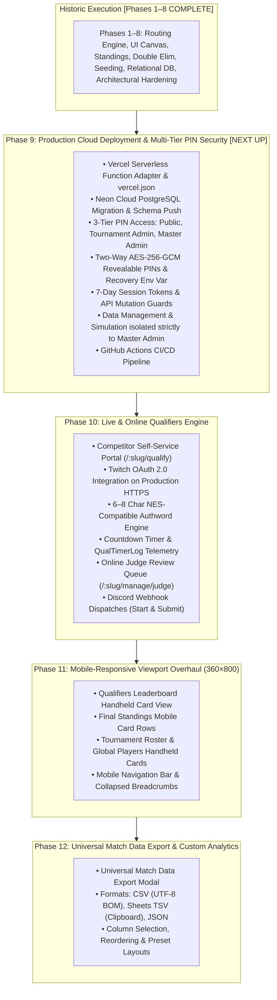

# Master Implementation Plan: Tournament Manager

This document is the consolidated, single source of truth for the implementation of **Tournament Manager** as specified in [SPEC.md / Tetris Tournament Manager.md](../Tetris%20Tournament%20Manager.md). It tracks completed execution, out-of-scope capabilities added along the way, and the prioritized roadmap for all remaining work.

---

## 1. Master Roadmap & Global Status (Phases 1–12)

| Phase | Title | Status | Description |
| :--- | :--- | :--- | :--- |
| **Phase 1** | Core Routing Engine | **Complete** | Mathematical Single-Elimination & Flat routing, bye invariants ($N - 1$ matches). |
| **Phase 2** | Reactive UI & Match Recording | **Complete** | Canvas visualizer, drawer score entry, multi-game tracking, Best-of-X overrides. |
| **Phase 3** | In-Memory Pipeline & Refinements | **Complete** | Mode unification (`isLocked`), global standings, maxout logic, global player catalog. |
| **Phase 4** | Tournament Organizations | **Complete** | Organization directory (`/organizations`), org branding & default rules inheritance, raw metric indexing. |
| **Phase 5** | Double Elimination Bracket Engine | **Complete** | Double elim (Winners, Losers, Grand Finals Reset), Accelerated Hybrid multi-pod layout, player journey search. |
| **Phase 6** | Direct / Manual Seeding & Bulk Import | **Complete** | Qual-less tournament seeding, multiline paste import, drag/drop reordering, tier dividers, direct bracket generation. |
| **Phase 7** | Relational Database & API Backend | **Complete** | PostgreSQL (Neon/Docker) + Drizzle ORM, REST API middleware, authentic player pool (1,620 competitors). |
| **Phase 8** | Architectural Hardening & Tournament Rules | **Complete** | Decoupled domain hooks, canonical defaults, CLI seeder, 415 automated tests, bye seed alternation (1 vs N), points qual 0-pt tiebreaker, OBS draft overlays. |
| **Phase 9** | **Production Cloud Deployment & Multi-Tier PIN Security** | **Next Up (Phase 9)** | Vercel Serverless runtime, Neon cloud PostgreSQL migration, 3-tier PIN access security (Public, Tournament Admin, Master Admin with AES-256 revealable PINs & secret recovery PIN), Data Management & Simulation isolated strictly to Master Admin. |
| **Phase 10**| **Live & Online Qualifiers Engine** | **Upcoming (Phase 10)** | Competitor self-service portal (`/:slug/qualify`), Twitch OAuth 2.0 on production HTTPS, 6–8 char NES Authwords, countdown telemetry, judge review queue, Discord webhooks. |
| **Phase 11**| **Mobile-Responsive Viewport Overhaul (360×800)** | **Upcoming (Phase 11)** | Handheld 360×800 dense table card views (Leaderboard, Standings, Roster, Global Players), collapsed mobile nav & breadcrumbs. |
| **Phase 12**| **Universal Match Data Export & Custom Analytics** | **Upcoming (Phase 12)** | Universal match data export (CSV with UTF-8 BOM, Google Sheets TSV clipboard copy, JSON) with custom column selection and reordering. |

---

## 2. Completed Phases & Historic Execution

### Phase 3: Unified In-Memory Pipeline, Adaptive Qual Board & Operational Polish [COMPLETE]
* **Priority 1: UI Rebranding, Ergonomics, Modal Guards & Mode Terminology:**
  * Rebranded UI to "Tournament Manager" (removed all legacy "CTWC" references).
  * Unified mode terminology: "Qualifiers Mode" (`isLocked === false`) vs "Match Play Mode" (`isLocked === true`).
  * Locked down match cards in `BracketVisualizer`, `OrganizerSheetMatrix`, and `MatchCardFeed` during Qualifiers Mode.
  * Disabled backdrop dismissal on `MatchScoreDrawer`, `PlayerDetailDrawer`, and `QualifierEntryModal`.
  * Added dirty state tracking to `TournamentAdminForm` ("Save Configuration" disabled until dirty) with unsaved changes navigation guard modal.
  * Bound tier colors dynamically (`primaryColor`, `secondaryColor`) to round badges, borders, winner highlights, and trophy icons.
* **Priority 2: Tournament Lifecycle & Simulation Controls:**
  * Replaced legacy `isVerified` and `qualsClosed` with single source of truth `isLocked: boolean`.
  * Enforced unlock safety invariant: blocking unlock if any match has recorded scores.
  * Clean-slate defaults on fresh onboarding (0 tournaments on home switcher; modal routes to `/:slug/manage/settings` with 0 data).
  * Data Management controls in Settings: "Seed Qualifiers Only" (bracket capacity + 4 DNQs), "Simulate Full Tournament" (complete match outcomes to champions), and "Clear All Tournament Data" (guarded by red speedbump confirmation modal). Purged legacy demo pipelines.
* **Priority 3: Global Tournament Standings & Competitive Exit Tiebreakers:**
  * Refactored `standings.ts` to output a unified #1 to #N global list across all tiers.
  * Implemented exact intra-round exit tiebreaker formula (exit game wins $\rightarrow$ loss avg $\rightarrow$ match record $\rightarrow$ game avg $\rightarrow$ seed).
  * Continuous `FinalStandingsTable.tsx` with overview stat cards, performance analytics columns, and Qual vs. Final rank delta badges.
* **Priority 4: Qualifiers Table Density & Competitor Detail Drawer:**
  * Implemented Maxout count ($\ge 999,999$) + kicker score sorting hierarchy in `scoring.ts`.
  * Format-dense column rendering on `LeaderboardTable.tsx` adapting to `HIGH_SCORE`, `AVERAGE_OF_X`, and `POINTS`.
  * Slide-out `PlayerDetailDrawer.tsx` displaying competitor profile, chronological qualifier submission audit log, and match breakdown.
* **Priority 5: Global Player Pool Directory & Tournament Roster:**
  * Master player directory under LocalStorage key `classic_tetris_global_players` at `/players`.
  * "Generate Fake Players" prompt modal with presets (`+8`, `+16`, `+32`, `+64`) generating realistic competitors.
  * Tournament roster registration with "Import from Global Pool" and "Import All Available" actions.
* **Priority 6: Accelerated Hybrid Layout, Player Journey Highlighting & Operational Polish:**
  * Accelerated Hybrid multi-pod layout: side-by-side Fit/Split views, scrollbar elimination in Pod 2, Pod 3 match centering, and responsive single-column collapse.
  * Competitor search input in `BracketTierBar` with auto-complete and zero-lag Player Journey SVG path illumination.
  * Double Elimination judge feed filtering: resolved stage filter desynchronization, unique round keys, and tier-switching remounting hygiene (`key={tier.id}`).
  * Established permanent automated regression test mandate in `AGENTS.md`.

---

### Phase 6: Direct / Manual Seeding & Roster Seeding Engine [COMPLETE]
* **Objective:** Enable tournament organizers to seed tournaments directly without requiring qualifier submissions, supporting invitationals, pre-ranked community events, and blind-draw tournaments.
* **Delivered Capabilities:**
  * **Seeding Mode Toggle:** Introduced `seedingMethod: 'QUALIFIERS' | 'MANUAL'` on `Tournament` with settings toggle in `TournamentAdminForm`. Qual-specific fields cleanly collapse when in manual mode.
  * **Bulk Seed Import (`BulkSeedImportModal.tsx`):** Large multiline paste modal. Parser strips bullets, numbering (`1. `, `#1 `, `- `), trims whitespace, and automatically resolves names against tournament rosters and the global player catalog.
  * **Interactive Seeding Manager (`ManualSeedingManager.tsx`):** Dedicated management view with drag-and-drop handles, Move Up/Down/Top/Bottom buttons, direct seed number assignment, reverse order, and Fisher-Yates random shuffle (with confirmation speedbump).
  * **Dynamic Tier Boundary Dividers:** Visual tier cutoff banners (Gold Tier, Silver Tier, Reserves/Alternate pool) rendered directly across the manual seed list.
  * **Bracket Generator Hook:** `generateDraftBracketsForTournament` directly bypasses `deriveLeaderboard` when in manual mode and distributes `manualSeeds` across tier capacities.
  * **Standings & Simulation Integration:** Computes `rankDelta` relative to assigned manual seeds; adapts simulation controls to generate realistic manual seedings.
  * **Automated Regression Suite:** 10 comprehensive tests in `src/features/tournament/__tests__/manualSeeding.test.ts`.

---

### Phase 7: Relational Database & Server API Backend [COMPLETE (FOUNDATION)]
* **Objective:** Transition `tournament-manager` from ephemeral client-side LocalStorage to a persistent relational database with server API routes.
* **Delivered Capabilities:**
  * **PostgreSQL Schema (`src/db/schema.ts`):** Complete relational models with foreign key constraints, cascading deletes, and indexes:
    * `organizations`: Organization identity, branding, theme colors, tier themes, default rules.
    * `players`: Competitor identity with `lower(trim(name))` uniqueness index, country, playstyle, PB, notes.
    * `tournaments`: Tournament identity, organization FK, qual format, points config, `is_locked`, metadata.
    * `bracket_tiers`: Tier configuration, tournament FK, priority order, bracket type, colors, metadata.
    * `tournament_players`: Roster assignments, player FK, tier FK, seed, qual completion status.
    * `qualifier_submissions`: Scores, timestamps, player FK, tournament FK.
    * `matches` & `games`: Relational match play tracking, game scores, Best-of-X, forfeit flags, winner/loser FKs.
  * **Database Infrastructure:** Docker compose environment (`docker-compose.yml`) running PostgreSQL 16 on port 5433, with Drizzle Kit push migrations (`npm run db:push`) and Drizzle Studio (`npm run db:studio`).
  * **Server API Middleware (`src/server/api.ts`):** Vite dev server API middleware supporting:
    * `/api/organizations`: Org CRUD, detail lookup by ID/slug, default rules sync.
    * `/api/tournaments`: Full tournament creation, retrieval, updates, and deletion.
    * `/api/players`: Player CRUD, directory lookups, search.
    * `/api/tournaments/:id/qualifiers`: Atomic score submission and batch qualifiers ingestion.
    * `/api/tournaments/:id/matches`: Match score recording and resets.
    * `/api/simulate/sample`: 1-click sample tournament generation.

---

### Out-of-Scope Capabilities Delivered Along the Way [COMPLETE]
* **1,620 Authentic Competitor Seed Dataset (`scripts/importPlayers.ts`):**
  Imported 1,620 real-world competitive Classic Tetris competitors with authentic names, randomized realistic countries, playstyles (Rolling, DAS, Hypertap), and personal bests (750k–1.4M) into PostgreSQL.
* **Cross-Platform CLI Compatibility:**
  Hardened database scripts, `drizzle.config.ts`, and Node execution hooks for seamless Windows PowerShell and POSIX execution.
* **Drizzle Studio Navigation Architecture:**
  Integrated schema relationships enabling Drizzle Studio's virtual navigation badges between parents and children (`bracket_tier`, `games`, `tournament`).

### Phase 8: Architectural Hardening, Domain Decoupling & Tournament Rules [COMPLETE]
* **Objective:** Eliminate monolithic state bottlenecks, decouple domain hooks, establish canonical entity factories, introduce fast test suites, and resolve all mathematical and lifecycle edge cases across 415 passing automated regression tests.
* **Delivered Capabilities:**
  * **Domain Hooks Decoupling:** Created independent domain hooks in `src/features/tournament/hooks/` (`useTournamentSettings`, `useQualifiers`, `useMatches`, `useGlobalPlayers`) with index re-exports and backward-compatible bindings in `store.tsx`.
  * **Single Entity Factory & Defaults (`src/features/tournament/defaults.ts`):** Canonical factories `createEmptyTournament()`, `createDefaultTier(priority)`, and `createEmptyPlayer()` implemented and adopted in `TournamentAdminForm.tsx` and `CreateTournamentModal.tsx`.
  * **Dedicated CLI Database Seed Script (`npm run db:seed`):** Standalone cross-platform script `scripts/seed.ts` seeding default organizations, 1,620 authentic competitors, and sample tournaments directly via Drizzle into PostgreSQL.
  * **Contract Alignment & Strict Type Invariants:** Eliminates loose `Record<string, any>` types with strict `TournamentMetadata`, `TierMetadata`, `OrganizationBranding`, and `OrganizationDefaultRules` in `types.ts` and `schema.ts`. Hardens `TierInput` and `TierRecord` to defensively support both `playerCount` and `numPlayers` and align `BracketRouting` with `TRADITIONAL_TREE`.
  * **Targeted Fast-Feedback NPM Test Scripts:** Added `npm run test:brackets` (~2.6s), `npm run test:api` (~5.5s), and `npm run test:ui` (~3.1s) to `package.json`.
  * **Agent Architecture Index:** Added Domain File Map and updated verification commands in `AGENTS.md`.
  * **Flat Bracket Bye Seed Alternation (1 vs N):** Updated `seed-utils.ts`, `flat.ts`, and `double-elimination.ts` so byes follow standard competitive tournament bracket alternation: highest seeds receive byes and face the lowest surviving seeds ($1 \text{ vs } N, 2 \text{ vs } N-1$), ensuring Seeds 1 and 2 only meet in the Finals.
  * **Points Qualifier Tiebreaker for 0-Point Players:** Updated `scoring.ts` to compute each player's highest single game score (`peakScore`) and sort descending as the primary tiebreaker for players with 0 points (and tied point totals).
  * **Simulation & Data Management Safety Hierarchy:** In `DataSimulationSection.tsx` and `TournamentAdminForm.tsx`, disabled and blocked "Clear Quals" whenever active match scores exist. Enforced the strict lifecycle hierarchy: "Clear Matches" must be executed before "Clear Quals" becomes enabled.
  * **Settings 'Add Tier' Button Placement:** Positioned the "+ Add Tier" button at the bottom of the tiers list when 1 or more tiers exist (retaining it prominently in the empty state when 0 tiers exist).
  * **Homepage Tournament Card Navigation to Admin Bracket View:** Routed homepage card "Brackets" action button and tier pill links directly to the admin management bracket view (`/:slug/manage/bracket/${tier.slug}`).
  * **Global Player Card Identity:** Extended `PlayerProfile`, database schema `players` table, API layer, `PlayerEditModal.tsx`, `PlayerDetailDrawer.tsx`, and `PlayerDirectory.tsx` with `displayName`, `nickname`, and `twitchUsername` (sanitizing `@` prefix and providing Twitch stream badges).
  * **Pre-Lock Bracket Visibility in OBS Overlays:** Created `ObsBracketView.tsx`, `ObsMatchCardView.tsx`, and `ObsOverlayPage.tsx` supporting draft bracket preview mode when `tournament.isLocked === false` with chroma key support (`?chroma=green|#hex`), generating draft/projected match nodes with live qualifier seeds or placeholder seeds and displaying a pulsing "DRAFT PREVIEW" header badge.
  * **Automated Regression Suite:** 12 tests in `src/features/tournament/__tests__/domainHooksAndDefaults.test.ts` and 7 tests in `src/features/tournament/__tests__/tournamentRulesAndLifecycleRegression.test.ts`.

---

## 3. Prioritized Implementation Roadmap (Remaining Work)

---

### Phase 9: Production Cloud Deployment & Multi-Tier PIN Access Security [NEXT UP]
* **Goal:** Deploy Tournament Manager to the public web (Vercel Serverless + Neon PostgreSQL) with 3-tier PIN access control so real-world users can safely view brackets while management operations are fully secured.
1. **Unified Vercel Serverless Runtime (`api/index.ts` & `vercel.json`):**
   * Wrap the existing `createApiMiddleware()` from `src/server/api.ts` into a Vercel Serverless Function adapter (`api/index.ts`).
   * Configure `vercel.json` rewrites to route `/api/(.*)` to the serverless function and all other routes to the static Vite frontend (`dist/index.html`).
   * Maintain 100% code reuse between local Vite dev server (`npm run dev`) and production Vercel deployment.
2. **Neon Cloud PostgreSQL Migration & CLI Pipelines:**
   * Leverage built-in `@neondatabase/serverless` connection support in `src/db/index.ts`.
   * Configure production `DATABASE_URL` against Neon serverless Postgres.
   * Run schema migrations (`npm run db:push`) and populate initial database with organizations and the 1,620 authentic competitors via `npm run db:seed`.
3. **Multi-Tier PIN Security Engine (Spec Sec 10 / 12):**
   * **Security Hierarchy:**
     * **Level 0 (Public / Spectator):** Unauthenticated visitors have access to public views (`/:slug/brackets`, `/:slug/quals`, `/:slug/standings`, `/:slug/qualify`, OBS overlays). Any attempt to access `/manage/*` or global admin routes (`/organizations`, `/players`) auto-redirects to the public tournament view.
     * **Level 1 (Tournament Admin):** Scoped by per-tournament PIN (`admin_pin_encrypted` in `tournaments` table). Grants access to the full tournament management left-nav (`/:slug/manage/*`). Unauthorized access attempts to global admin views redirect back to the tournament management dashboard.
     * **Level 2 (Master Admin):** Authenticated via Master PIN (`master_pin_encrypted` in DB). Grants unrestricted global access: organization directory, all tournaments, global player directory, and viewing/editing all tournament PINs.
     * **Emergency Master Recovery PIN:** Configured via environment variable (`MASTER_ADMIN_RECOVERY_PIN` in `.env`) providing an immutable fallback that can never be locked out even if the database is altered.
   * **Data Management & Simulation Access Control:**
     * Destructive controls in `DataSimulationSection.tsx` ("Clear All Tournament Data", "Simulate Full Tournament", "Seed Qualifiers Only") and corresponding API endpoints (`/api/simulate/sample`, bulk reset operations) are **strictly isolated to Master/System Admins**.
     * Tournament Admins cannot view, access, or trigger simulation or data wipe actions, preventing accidental wiping of real tournament data by event directors or floor judges.
   * **AES-256-GCM Two-Way Encryption (`pinCrypto.ts`):**
     * Encrypts tournament PINs at rest using server secret key `PIN_ENCRYPTION_KEY`.
     * Enables Master Admins to safely reveal and copy tournament PINs in the dashboard (`👁️ 7492`) without resetting them or invalidating active judge sessions.
   * **Session Management & API Route Mutation Guards:**
     * Dedicated PIN Login page (`/admin` or `/auth/pin`).
     * Issues signed 7-day session token stored in `localStorage` (with explicit "Lock / Log Out" button in navbar). PINs themselves remain permanent unless explicitly modified.
     * Server API middleware enforces `Authorization: Bearer <sessionToken>` on all mutation routes (`POST`, `PUT`, `DELETE`).
4. **CI/CD Automation:**
   * GitHub Actions workflow validating typechecks (`npm run typecheck`) and regression tests (`npm test`) on pull requests and pushes to `main`.

---

### Phase 10: Live & Online Qualifiers Engine [UPCOMING]
* **Goal:** Deliver the full online self-service competitor qualification portal per Master Spec Section 10, running directly against the deployed production HTTPS environment.
1. **Competitor Self-Service Portal (`/:slug/qualify`):**
   * Public onboarding view for remote competitors.
   * Twitch OAuth 2.0 integration (using production HTTPS callback URL) retrieving Twitch handle, avatar, and channel link.
2. **NES-Compatible Authword Engine (Spec Sec 10.2):**
   * Curated dictionary of ~1,000 family-friendly English words ($\ge 6$ letters).
   * Strict NES character set enforcement (`A–Z`, `0–9`, `.`, `-`, `!`, `♥`; no spaces).
   * Support for custom approved words in Tournament Settings.
3. **Countdown Timer & Telemetry Logging (Spec Sec 10.3):**
   * Non-blocking countdown timer inheriting `qualWindowMinutes`.
   * Captures `QualTimerLog` telemetry (`startedAt`, `submittedAt`, `elapsedSeconds`, `pauses`).
4. **Online Judge Review Queue & Verification Drawer (Spec Sec 10.4):**
   * Dedicated judge review drawer (`/:slug/manage/judge`) for incoming submissions.
   * Embedded Twitch VOD player, 10k topout authword check, timer telemetry log inspection.
   * Actions: "Verify Qual", "Edit Score", "Mark DNQ", "Disqualify (DQ)".
5. **Discord Webhooks Integration:**
   * Automated dispatches on qual start and qual submit with Twitch stream link and score.
6. **Tournament Mode Toggle:**
   * Support `IN_PERSON`, `ONLINE`, and `HYBRID` modes.

---

### Phase 11: Mobile-Responsive Viewport Overhaul (360×800 Viewport) [UPCOMING]
* **Goal:** Guarantee all data-dense views are fully readable and operational on smartphone screens without horizontal scroll clipping per Master Spec Section 11.2 / 13.2.
1. **Qualifiers Leaderboard:** Compact mobile card/accordion view displaying Rank, Player, Playstyle, Status, and Attempts/Scores.
2. **Final Standings:** Mobile card rows preserving Final Rank, Competitor, Seed Delta badge, and Stage Reached.
3. **Tournament Roster & Global Players Directory:** Handheld cards for player management and search.
4. **Global Navigation & Header:** Hamburger menu / mobile bottom tab bar and collapsed breadcrumbs on viewports $< 768\text{px}$.

---

### Phase 12: Universal Match Data Export & Custom Analytics [UPCOMING]
* **Goal:** Finalize export pipelines and reporting tools per Master Spec Section 11.
1. **Universal Match Data Export Modal:**
   * Configurable column toggles (Tournament, Tier, Stage, Round, Players, Seeds, Game Scores, Winner, Forfeit).
   * Formats: CSV (with UTF-8 BOM encoding for Excel), TSV (direct paste into Google Sheets), and JSON.
   * Column reordering and export presets ("CTWC Match Sheet", "Detailed Audit", "Simple Bracket Results").

---

## 4. Verification & Testing Standards

Per workspace guidelines in `AGENTS.md`:
* **Mandatory Regression Tests:** Every bug fix, rule adjustment, and feature must include automated regression tests in `src/api/__tests__/` or `src/features/*/__tests__/`.
* **Verification Scope:** Tests must verify failure on the buggy state and pass with the fix across all supported bracket types (Single, Double Elimination variants: Traditional, Flat Staged, Accelerated Hybrid), filter interactions, and tier-switching states.
* **Test Suite Health:** All tests must pass cleanly (`npm test`) with zero TypeScript errors (`npm run typecheck`).

## 5. Operational Defect Tracking & Verification Status

- **Note 1:** *When match play hasn't been finalized but the brackets have been specified in settings, you can see the brackets as an admin or in public view but not in overlays.*
  * **Status:** **RESOLVED (Phase 8, Item 7).** OBS overlay components (`ObsBracketView.tsx`, `ObsMatchCardView.tsx`, and dedicated routes) render projected draft brackets and placeholder match seeds prior to match lock with full chroma key support.

- **Note 2:** *When the db is down, there doesn't seem to be any indicators in the main global UI that it's down. If the DB goes down and you were admining a tournament, it also doesn't mention that it's down.*
  * **Status:** **RESOLVED.**
    * Active `/api/health` database ping endpoint implemented (`SELECT 1` returns 200 `{ db: 'connected' }` or 503 `{ db: 'disconnected' }`).
    * Real-time DB offline detection wired into `TournamentProvider` store hydration and mutations (`isDbConnected`, `dbError`, `checkDbHealth`, `retryConnection`).
    * Sticky top-level offline alert banner rendered with "Retry Connection" action.
    * Prominent PostgreSQL Offline card rendered on `TournamentSwitcherPage` with `npm run db:up` guidance.
    * `🔴 DB OFFLINE` indicator badges added to `TournamentNavbar` and `TournamentSidebar`.
    * Unit & regression tests added in `src/server/__tests__/apiSimulation.test.ts`.

- **Note 3:** *Sample orgs for "CTWC" and "CTM" don't seem to be connected to any database at all. Let's just drop both for now; later we're going to want to seed the data so no reason to preserve the samples for now.*
  * **Status:** **RESOLVED.**
    * Hardcoded mock objects in `DEFAULT_ORGANIZATIONS` purged.
    * Made `tournaments.organizationId` nullable in `schema.ts`, `testDb.ts`, and `types.ts` to cleanly support independent tournaments without requiring foreign key references to mock organizations.
    * Removed all fallback references to `'org_ctwc'` across `store.tsx`, `TournamentAdminForm.tsx`, `tournaments.ts`, and `CreateTournamentModal.tsx`.
    * Cleaned up dropdown and organization views to gracefully handle empty organization catalogs.
