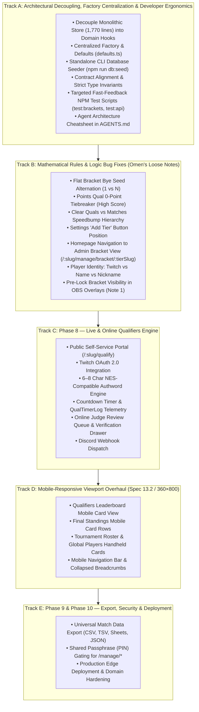

# Master Implementation Plan: Tournament Manager

This document is the consolidated, single source of truth for the implementation of **Tournament Manager** as specified in [SPEC.md / Tetris Tournament Manager.md](../Tetris%20Tournament%20Manager.md). It tracks completed execution, out-of-scope capabilities added along the way, and the prioritized roadmap for all remaining work.

---

## 1. Master Roadmap & Global Status (Phases 1–10)

| Phase | Title | Status | Description |
| :--- | :--- | :--- | :--- |
| **Phase 1** | Core Routing Engine | **Complete** | Mathematical Single-Elimination & Flat routing, bye invariants ($N - 1$ matches). |
| **Phase 2** | Reactive UI & Match Recording | **Complete** | Canvas visualizer, drawer score entry, multi-game tracking, Best-of-X overrides. |
| **Phase 3** | In-Memory Pipeline & Refinements | **Complete** | Mode unification (`isLocked`), global standings, maxout logic, global player catalog. |
| **Phase 4** | Tournament Organizations | **Complete** | Organization directory (`/organizations`), org branding & default rules inheritance, raw metric indexing. |
| **Phase 5** | Double Elimination Bracket Engine | **Complete** | Double elim (Winners, Losers, Grand Finals Reset), Accelerated Hybrid multi-pod layout, player journey search. |
| **Phase 6** | Direct / Manual Seeding & Bulk Import | **Complete** | Qual-less tournament seeding, multiline paste import, drag/drop reordering, tier dividers, direct bracket generation. |
| **Phase 7** | Relational Database & API Backend | **Complete (Foundation)** | PostgreSQL (Neon/Docker) + Drizzle ORM, REST API middleware, authentic player pool (1,620 competitors). *(RBAC & R2 avatar uploads deferred).* |
| **Phase 8** | **Live & Online Qualifiers Engine** | **Next Up (Priority Track C)** | Competitor self-service portal (`/:slug/qualify`), Twitch OAuth 2.0, NES Authwords, countdown timer, online judge review queue, Discord webhooks. |
| **Phase 9** | Match Data Export & Custom Analytics | **Upcoming (Priority Track E)** | Universal match data export (CSV/TSV/Sheets/JSON) with customizable column selection and reordering. |
| **Phase 10**| Production Deployment & PIN Security | **Upcoming (Priority Track E)** | Shared Passphrase (PIN) gating all `/manage/*` routes, Vercel edge deployment, custom domains. |

---

## 2. Completed Phases & Historic Execution

### Phase 3: Unified In-Memory Pipeline, Adaptive Qual Board & Operational Polish [COMPLETE]
* **Priority 1: UI Rebranding, Ergonomics, Modal Guards & Mode Terminology:**
  * Rebranded UI to "Tournament Manager" (removed all legacy "CTWC" references).
  * Unified mode terminology: "Qualifiers Mode" (`isLocked === false`) vs "Match Play Mode" (`isLocked === true`).
  * Locked down match cards in `BracketVisualizer`, `OrganizerSheetMatrix`, and `MatchCardFeed` during Qualifiers Mode.
  * Disabled backdrop dismissal on `MatchScoreDrawer`, `PlayerDetailDrawer`, and `QualifierEntryModal`.
  * Added dirty state tracking to `TournamentAdminForm` ("Save Configuration" disabled until dirty) with unsaved changes navigation guard modal.
  * Bound tier colors dynamically (`primaryColor`, `secondaryColor`) to round badges, borders, winner highlights, and trophy icons.
* **Priority 2: Tournament Lifecycle & Simulation Controls:**
  * Replaced legacy `isVerified` and `qualsClosed` with single source of truth `isLocked: boolean`.
  * Enforced unlock safety invariant: blocking unlock if any match has recorded scores.
  * Clean-slate defaults on fresh onboarding (0 tournaments on home switcher; modal routes to `/:slug/manage/settings` with 0 data).
  * Data Management controls in Settings: "Seed Qualifiers Only" (bracket capacity + 4 DNQs), "Simulate Full Tournament" (complete match outcomes to champions), and "Clear All Tournament Data" (guarded by red speedbump confirmation modal). Purged legacy demo pipelines.
* **Priority 3: Global Tournament Standings & Competitive Exit Tiebreakers:**
  * Refactored `standings.ts` to output a unified #1 to #N global list across all tiers.
  * Implemented exact intra-round exit tiebreaker formula (exit game wins $\rightarrow$ loss avg $\rightarrow$ match record $\rightarrow$ game avg $\rightarrow$ seed).
  * Continuous `FinalStandingsTable.tsx` with overview stat cards, performance analytics columns, and Qual vs. Final rank delta badges.
* **Priority 4: Qualifiers Table Density & Competitor Detail Drawer:**
  * Implemented Maxout count ($\ge 999,999$) + kicker score sorting hierarchy in `scoring.ts`.
  * Format-dense column rendering on `LeaderboardTable.tsx` adapting to `HIGH_SCORE`, `AVERAGE_OF_X`, and `POINTS`.
  * Slide-out `PlayerDetailDrawer.tsx` displaying competitor profile, chronological qualifier submission audit log, and match breakdown.
* **Priority 5: Global Player Pool Directory & Tournament Roster:**
  * Master player directory under LocalStorage key `classic_tetris_global_players` at `/players`.
  * "Generate Fake Players" prompt modal with presets (`+8`, `+16`, `+32`, `+64`) generating realistic competitors.
  * Tournament roster registration with "Import from Global Pool" and "Import All Available" actions.
* **Priority 6: Accelerated Hybrid Layout, Player Journey Highlighting & Operational Polish:**
  * Accelerated Hybrid multi-pod layout: side-by-side Fit/Split views, scrollbar elimination in Pod 2, Pod 3 match centering, and responsive single-column collapse.
  * Competitor search input in `BracketTierBar` with auto-complete and zero-lag Player Journey SVG path illumination.
  * Double Elimination judge feed filtering: resolved stage filter desynchronization, unique round keys, and tier-switching remounting hygiene (`key={tier.id}`).
  * Established permanent automated regression test mandate in `AGENTS.md`.

---

### Phase 6: Direct / Manual Seeding & Roster Seeding Engine [COMPLETE]
* **Objective:** Enable tournament organizers to seed tournaments directly without requiring qualifier submissions, supporting invitationals, pre-ranked community events, and blind-draw tournaments.
* **Delivered Capabilities:**
  * **Seeding Mode Toggle:** Introduced `seedingMethod: 'QUALIFIERS' | 'MANUAL'` on `Tournament` with settings toggle in `TournamentAdminForm`. Qual-specific fields cleanly collapse when in manual mode.
  * **Bulk Seed Import (`BulkSeedImportModal.tsx`):** Large multiline paste modal. Parser strips bullets, numbering (`1. `, `#1 `, `- `), trims whitespace, and automatically resolves names against tournament rosters and the global player catalog.
  * **Interactive Seeding Manager (`ManualSeedingManager.tsx`):** Dedicated management view with drag-and-drop handles, Move Up/Down/Top/Bottom buttons, direct seed number assignment, reverse order, and Fisher-Yates random shuffle (with confirmation speedbump).
  * **Dynamic Tier Boundary Dividers:** Visual tier cutoff banners (Gold Tier, Silver Tier, Reserves/Alternate pool) rendered directly across the manual seed list.
  * **Bracket Generator Hook:** `generateDraftBracketsForTournament` directly bypasses `deriveLeaderboard` when in manual mode and distributes `manualSeeds` across tier capacities.
  * **Standings & Simulation Integration:** Computes `rankDelta` relative to assigned manual seeds; adapts simulation controls to generate realistic manual seedings.
  * **Automated Regression Suite:** 10 comprehensive tests in `src/features/tournament/__tests__/manualSeeding.test.ts`.

---

### Phase 7: Relational Database & Server API Backend [COMPLETE (FOUNDATION)]
* **Objective:** Transition `tournament-manager` from ephemeral client-side LocalStorage to a persistent relational database with server API routes.
* **Delivered Capabilities:**
  * **PostgreSQL Schema (`src/db/schema.ts`):** Complete relational models with foreign key constraints, cascading deletes, and indexes:
    * `organizations`: Organization identity, branding, theme colors, tier themes, default rules.
    * `players`: Competitor identity with `lower(trim(name))` uniqueness index, country, playstyle, PB, notes.
    * `tournaments`: Tournament identity, organization FK, qual format, points config, `is_locked`, metadata.
    * `bracket_tiers`: Tier configuration, tournament FK, priority order, bracket type, colors, metadata.
    * `tournament_players`: Roster assignments, player FK, tier FK, seed, qual completion status.
    * `qualifier_submissions`: Scores, timestamps, player FK, tournament FK.
    * `matches` & `games`: Relational match play tracking, game scores, Best-of-X, forfeit flags, winner/loser FKs.
  * **Database Infrastructure:** Docker compose environment (`docker-compose.yml`) running PostgreSQL 16 on port 5433, with Drizzle Kit push migrations (`npm run db:push`) and Drizzle Studio (`npm run db:studio`).
  * **Server API Middleware (`src/server/api.ts`):** Vite dev server API middleware supporting:
    * `/api/organizations`: Org CRUD, detail lookup by ID/slug, default rules sync.
    * `/api/tournaments`: Full tournament creation, retrieval, updates, and deletion.
    * `/api/players`: Player CRUD, directory lookups, search.
    * `/api/tournaments/:id/qualifiers`: Atomic score submission and batch qualifiers ingestion.
    * `/api/tournaments/:id/matches`: Match score recording and resets.
    * `/api/simulate/sample`: 1-click sample tournament generation.

---

### Out-of-Scope Capabilities Delivered Along the Way [COMPLETE]
* **1,620 Authentic Competitor Seed Dataset (`scripts/importPlayers.ts`):**
  Imported 1,620 real-world competitive Classic Tetris competitors with authentic names, randomized realistic countries, playstyles (Rolling, DAS, Hypertap), and personal bests (750k–1.4M) into PostgreSQL.
* **Cross-Platform CLI Compatibility:**
  Hardened database scripts, `drizzle.config.ts`, and Node execution hooks for seamless Windows PowerShell and POSIX execution.
* **Drizzle Studio Navigation Architecture:**
  Integrated schema relationships enabling Drizzle Studio's virtual navigation badges between parents and children (`bracket_tier`, `games`, `tournament`).

---

## 3. Prioritized Implementation Roadmap (Remaining Work)

---

### Track A: Architectural Decoupling, Factory Centralization & Developer Ergonomics [COMPLETE]
* **Goal:** Eliminate monolithic state/form bottlenecks, eliminate defensive mock fallbacks, centralize entity defaults, and introduce fast domain test commands so all subsequent development runs with minimal agent scanning tokens and near-zero credit overhead.
* **Delivered Capabilities:**
  * **Domain Hooks Decoupling:** Created independent domain hooks in `src/features/tournament/hooks/` (`useTournamentSettings`, `useQualifiers`, `useMatches`, `useGlobalPlayers`) with index re-exports and backward-compatible bindings in `store.tsx`.
  * **Single Entity Factory & Defaults (`src/features/tournament/defaults.ts`):** Canonical factories `createEmptyTournament()`, `createDefaultTier(priority)`, and `createEmptyPlayer()` implemented and adopted in `TournamentAdminForm.tsx` and `CreateTournamentModal.tsx`.
  * **Dedicated CLI Database Seed Script (`npm run db:seed`):** Standalone cross-platform script `scripts/seed.ts` seeding default organizations, 1,620 authentic competitors, and sample tournaments directly via Drizzle into PostgreSQL.
  * **Contract Alignment & Strict Type Invariants:** Eliminates loose `Record<string, any>` types with strict `TournamentMetadata`, `TierMetadata`, `OrganizationBranding`, and `OrganizationDefaultRules` in `types.ts` and `schema.ts`. Hardens `TierInput` and `TierRecord` to defensively support both `playerCount` and `numPlayers` and align `BracketRouting` with `TRADITIONAL_TREE`.
  * **Targeted Fast-Feedback NPM Test Scripts:** Added `npm run test:brackets` (~2.6s), `npm run test:api` (~5.5s), and `npm run test:ui` (~3.1s) to `package.json`.
  * **Agent Architecture Index:** Added Domain File Map and updated verification commands in `AGENTS.md`.
  * **Automated Regression Suite:** 12 tests in `src/features/tournament/__tests__/domainHooksAndDefaults.test.ts`.

---

### Track B: Mathematical Rules & Logic Bug Fixes (Omen's Loose Notes) [COMPLETE]
* **Goal:** Eliminate all observed tournament rule discrepancies, navigation misdirections, and simulation safety flaws built on top of the clean decoupled architecture.
* **Status:** **COMPLETE** (All 7 bug fix items implemented and verified across 415 passing automated regression tests).

#### 1. Flat Bracket Bye Seed Alternation [COMPLETE]
* **Problem:** In Flat Single and Double Elimination brackets, byes were previously paired sequentially ($1 \text{ vs } 2, 3 \text{ vs } 4$).
* **Fix:** Updated `seed-utils.ts`, `flat.ts`, and `double-elimination.ts` so byes follow standard competitive tournament bracket alternation: highest seeds receive byes and face the lowest surviving seeds ($1 \text{ vs } N, 2 \text{ vs } N-1$), ensuring Seeds 1 and 2 only meet in the Finals.
* **Files:** `src/features/bracket/math/seed-utils.ts`, `src/features/bracket/math/flat.ts`, `src/features/bracket/math/double-elimination.ts`.

#### 2. Points Qualifier Tiebreaker for 0-Point Players [COMPLETE]
* **Problem:** In `POINTS` qualifier format, players with $0$ points previously floated in arbitrary/random order.
* **Fix:** Updated `scoring.ts` to compute each player's highest single game score (`peakScore`) and sort descending as the primary tiebreaker for players with 0 points (and tied point totals).
* **Files:** `src/features/qualifiers/scoring.ts`, `src/features/qualifiers/__tests__/scoring.test.ts`.

#### 3. Simulation & Data Management Safety Hierarchy [COMPLETE]
* **Problem:** Admins could accidentally clear qualifier data while active matches existed, creating orphaned match records.
* **Fix:** In `DataSimulationSection.tsx` and `TournamentAdminForm.tsx`, disabled and blocked "Clear Quals" whenever active match scores exist. Enforced the strict lifecycle hierarchy: "Clear Matches" must be executed before "Clear Quals" becomes enabled.
* **Files:** `src/features/tournament/components/TournamentAdminForm.tsx`, `src/features/tournament/components/settings/DataSimulationSection.tsx`.

#### 4. Settings "Add Tier" Button Placement [COMPLETE]
* **Problem:** The "+ Add Tier" button at the top required organizers to scroll down to find the newly added tier.
* **Fix:** Positioned the "+ Add Tier" button at the bottom of the tiers list when 1 or more tiers exist (retaining it prominently in the empty state when 0 tiers exist).
* **Files:** `src/features/tournament/components/settings/TierManagementSection.tsx`.

#### 5. Homepage Tournament Card Navigation to Admin Bracket View [COMPLETE]
* **Problem:** Clicking Bracket (or tier pills) on homepage cards routed users into the public/spectator view (`/:slug/:tierSlug`), forcing organizers to constantly click Admin to access the admin management view.
* **Fix:** Routed homepage card "Brackets" action button and tier pill links directly to the admin management bracket view (`/:slug/manage/bracket/${tier.slug}`).
* **Files:** `src/features/tournament/components/TournamentCard.tsx`.

#### 6. Global Player Card Identity [COMPLETE]
* **Problem:** The competitor model lacked distinct separation between Twitch handle, competitive display name, and personal nickname.
* **Fix:** Extended `PlayerProfile`, database schema `players` table, API layer, `PlayerEditModal.tsx`, `PlayerDetailDrawer.tsx`, and `PlayerDirectory.tsx` with `displayName`, `nickname`, and `twitchUsername` (sanitizing `@` prefix and providing Twitch stream badges). Ran `npm run db:push` against PostgreSQL container.
* **Files:** `src/features/tournament/types.ts`, `src/db/schema.ts`, `src/api/players.ts`, `src/features/players/components/PlayerEditModal.tsx`, `src/features/qualifiers/components/PlayerDetailDrawer.tsx`, `src/features/players/components/PlayerDirectory.tsx`.

#### 7. Pre-Lock Bracket Visibility in OBS Overlays (Note 1) [COMPLETE]
* **Problem:** When match play hasn't been finalized but bracket tiers have been specified in settings, brackets were visible to admins and in the public view, but OBS overlays did not display or preview them.
* **Fix:** Created `ObsBracketView.tsx`, `ObsMatchCardView.tsx`, and `ObsOverlayPage.tsx` supporting draft bracket preview mode when `tournament.isLocked === false` with chroma key support (`?chroma=green|#hex`), generating draft/projected match nodes with live qualifier seeds or placeholder seeds and displaying a pulsing "DRAFT PREVIEW" header badge.
* **Files:** `src/features/obs/components/ObsBracketView.tsx`, `src/features/obs/components/ObsMatchCardView.tsx`, `src/routes/ObsOverlayPage.tsx`, `src/routes/PublicTierBracketPage.tsx`, `src/features/qualifiers/scoring.ts`, `src/App.tsx`.

---

### Track C: Master Spec Phase 8 — Live & Online Qualifiers Engine
* **Goal:** Deliver the full online self-service competitor qualification portal per Master Spec Section 10.

1. **Competitor Self-Service Portal (`/:slug/qualify`):**
   * Public onboarding view for remote competitors.
   * Twitch OAuth 2.0 integration (retrieves Twitch username, channel ID, and avatar).
2. **NES-Compatible Authword Engine (Spec Sec 10.2):**
   * Curated dictionary of ~1,000 family-friendly English words ($\ge 6$ letters).
   * Strict NES character set enforcement (`A–Z`, `0–9`, `.`, `-`, `!`, `♥`; no spaces).
   * Support for custom approved words in Tournament Settings.
3. **Countdown Timer & Telemetry Logging (Spec Sec 10.3):**
   * Non-blocking countdown timer inheriting `qualWindowMinutes`.
   * Captures `QualTimerLog` telemetry (`startedAt`, `submittedAt`, `elapsedSeconds`, `pauses`).
4. **Online Judge Review Queue & Verification Drawer (Spec Sec 10.4):**
   * Dedicated judge review drawer for incoming submissions.
   * Embedded Twitch VOD player, 10k topout authword check, timer telemetry log inspection.
   * Actions: "Verify Qual", "Edit Score", "Mark DNQ", "Disqualify (DQ)".
5. **Discord Webhooks Integration:**
   * Automated dispatches on qual start and qual submit with Twitch stream link and score.
6. **Tournament Mode Toggle:**
   * Support `IN_PERSON`, `ONLINE`, and `HYBRID` modes.

---

### Track D: Master Spec Section 13.2 — Mobile-Responsive Overhaul (360×800 Viewport)
* **Goal:** Guarantee all data-dense views are fully readable and operational on smartphone screens without horizontal scroll clipping.

1. **Qualifiers Leaderboard:** Compact mobile card/accordion view displaying Rank, Player, Playstyle, Status, and Attempts/Scores.
2. **Final Standings:** Mobile card rows preserving Final Rank, Competitor, Seed Delta badge, and Stage Reached.
3. **Tournament Roster & Global Players Directory:** Mobile card rows for player management.
4. **Global Navigation & Header:** Hamburger menu / mobile bottom tab bar and collapsed breadcrumbs on viewports $< 768\text{px}$.

---

### Track E: Master Spec Phases 9 & 10 — Export, Security & Production Deployment
* **Goal:** Finalize export pipelines, access controls, and hosting configuration.

1. **Universal Match Data Export Modal (Phase 9):**
   * Configurable column toggles (Tournament, Tier, Stage, Round, Players, Seeds, Game Scores, Winner, Forfeit).
   * Formats: CSV, TSV (direct paste into Google Sheets), and JSON.
   * Column reordering and export presets ("CTWC Match Sheet", "Detailed Audit").
2. **Shared PIN Security (Phase 10):**
   * Passphrase gating for all `/manage/*` routes.
3. **Production Deployment (Phase 10):**
   * Vercel edge deployment configuration, environment variable hardening, custom domain setup.

---

## 4. Verification & Testing Standards

Per workspace guidelines in `AGENTS.md`:
* **Mandatory Regression Tests:** Every bug fix, rule adjustment, and feature must include automated regression tests in `src/api/__tests__/` or `src/features/*/__tests__/`.
* **Verification Scope:** Tests must verify failure on the buggy state and pass with the fix across all supported bracket types (Single, Double Elimination variants: Traditional, Flat Staged, Accelerated Hybrid), filter interactions, and tier-switching states.
* **Test Suite Health:** All tests must pass cleanly (`npm test`) with zero TypeScript errors (`npm run typecheck`).

## 5. Omen's bug notes & Resolution Status

- **Note 1:** *When match play hasn't been finalized but the brackets have been specified in settings, you can see the brackets as an admin or in public view but not in overlays.*
  * **Status:** Scheduled under **Track B, Item 7**. Will be addressed directly as part of Track B fixes.

- **Note 2:** *When the db is down, there doesn't seem to be any indicators in the main global UI that it's down. If the DB goes down and you were admining a tournament, it also doesn't mention that it's down.*
  * **Status:** **RESOLVED.**
    * Active `/api/health` database ping endpoint implemented (`SELECT 1` returns 200 `{ db: 'connected' }` or 503 `{ db: 'disconnected' }`).
    * Real-time DB offline detection wired into `TournamentProvider` store hydration and mutations (`isDbConnected`, `dbError`, `checkDbHealth`, `retryConnection`).
    * Sticky top-level offline alert banner rendered with "Retry Connection" action.
    * Prominent PostgreSQL Offline card rendered on `TournamentSwitcherPage` with `npm run db:up` guidance.
    * `🔴 DB OFFLINE` indicator badges added to `TournamentNavbar` and `TournamentSidebar`.
    * Unit & regression tests added in `src/server/__tests__/apiSimulation.test.ts`.

- **Note 3:** *Sample orgs for "CTWC" and "CTM" don't seem to be connected to any database at all. Let's just drop both for now; later we're going to want to seed the data so no reason to preserve the samples for now.*
  * **Status:** **RESOLVED.**
    * Hardcoded mock objects in `DEFAULT_ORGANIZATIONS` purged.
    * Made `tournaments.organizationId` nullable in `schema.ts`, `testDb.ts`, and `types.ts` to cleanly support independent tournaments without requiring foreign key references to mock organizations.
    * Removed all fallback references to `'org_ctwc'` across `store.tsx`, `TournamentAdminForm.tsx`, `tournaments.ts`, and `CreateTournamentModal.tsx`.
    * Cleaned up dropdown and organization views to gracefully handle empty organization catalogs.
