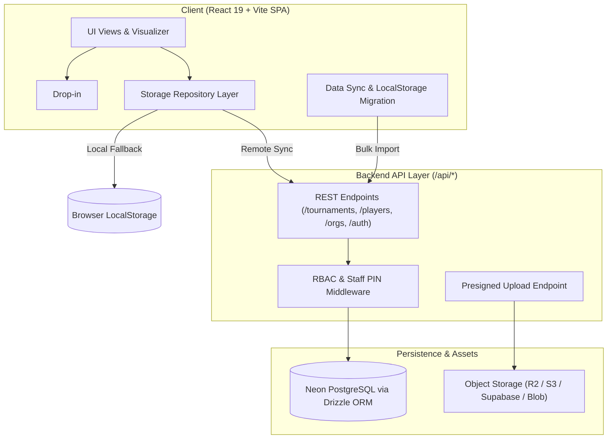

# Phase 7 Implementation Plan: Relational Persistence, Avatar System & RBAC

This implementation plan details the architectural execution of **Phase 7: Relational Persistence, Avatar System, & Role-Based Access Control (RBAC)** as outlined in the [SPEC.md / Tetris Tournament Manager.md](../Tetris%20Tournament%20Manager.md) and synthesized with the [avatar_and_phase7_schema_sketch.md](avatar_and_phase7_schema_sketch.md).

Phase 7 transitions the application from a client-side `localStorage`-only data store to a resilient, production-ready relational architecture powered by **Neon PostgreSQL** and **Drizzle ORM**, introduces a unified **Competitor Avatar System** (supporting both vector country flags and custom user uploads), provides a seamless **LocalStorage-to-Postgres Migration Pipeline**, and establishes **Role-Based Access Control (RBAC)** to secure director operations and judge stations.

---

## Master Roadmap Overview (Phases 1–10)

| Phase | Title | Status | Description |
| :--- | :--- | :--- | :--- |
| **Phase 1** | Core Routing Engine | **Complete** | Mathematical Single-Elimination & Flat routing, bye invariants. |
| **Phase 2** | Reactive UI & Match Recording | **Complete** | Canvas visualizer, drawer score entry, multi-game tracking. |
| **Phase 3** | In-Memory Pipeline & Refinements | **Complete** | Mode unification (`isLocked`), global standings, maxout logic, global player pool (`classic_tetris_global_players`). |
| **Phase 4** | Tournament Organizations | **Complete** | Organization directory (`/organizations`), org branding & default rules inheritance, raw metric indexing. |
| **Phase 5** | Double Elimination Bracket Engine | **Complete** | Double elim (Winners, Losers, Grand Finals Reset), Accelerated Hybrid multi-pod engine, player journey search. |
| **Phase 6** | Direct Seeding Engine & Bulk Import | **Complete** | Qual-less tournament seeding, multiline paste import, drag/drop reordering, tier boundary dividers, direct bracket generation. |
| **Phase 7** | **Relational Persistence, Avatars & RBAC** | **In Progress** | **Neon PostgreSQL + Drizzle ORM, unified `<PlayerAvatar />` component, custom image upload storage, LocalStorage-to-DB migration, and RBAC / staff PIN guards.** |
| **Phase 8** | Online Qualifiers & Competitor Portal | Upcoming | Twitch OAuth 2.0, NES Authwords, session countdown timer, online judge review queue, Discord webhooks. |
| **Phase 9** | Match Data Export & Custom Analytics | Upcoming | Universal match data export (CSV/TSV/Excel), customizable field toggles and column ordering. |
| **Phase 10** | Production Deployment & Polish | Upcoming | Vercel edge deployment, custom domains, performance audits. |

---

## Architectural Pillars of Phase 7

---

## Scoped Priorities & Phased Milestones

### Priority 7a: Relational Database Schema & Drizzle ORM Definition

#### Objectives:
1. Establish a single source of truth for the relational data schema in `src/db/schema.ts` using Drizzle ORM with PostgreSQL dialect.
2. Mirror all existing domain models from [src/features/tournament/types.ts](file:///c:/Coding/tournament-manager/src/features/tournament/types.ts) and [src/features/organizations/types.ts](file:///c:/Coding/tournament-manager/src/features/organizations/types.ts).
3. Bake in avatar fields (`avatar_type`, `avatar_url`, `avatar_thumbnail_url`) and RBAC fields from day 1.

#### Database Tables:
* **`organizations`**: Master entity for leagues and event series (CTWC, Monthly Opens).
* **`players`**: Global competitor identity catalog (`classic_tetris_global_players`), holding cross-tournament stats, personal bests, and avatar configurations.
* **`tournaments`**: Tournaments scoped to organizations, seeding configurations (`QUALIFIERS` vs `MANUAL`), locking status, and manual seed orders.
* **`tournament_players`**: Join table tracking tournament enrollment, disqualifications, verification status, and qualifier flags.
* **`tiers`**: Bracket divisions (Gold, Silver, etc.), bracket dimensions, routing types (`TRADITIONAL`, `FLAT`, `ACCELERATED_HYBRID`), theme palettes, and serialized `bracket_data` (JSONB).
* **`qualifier_submissions`**: Individual qualifier run logs and timestamps.
* **`match_scores`**: Recorded head-to-head match outcomes, individual game logs, and winner IDs.
* **`users` & `staff_roles`**: Staff identity, role definitions (`SUPERADMIN`, `ORG_ADMIN`, `DIRECTOR`, `JUDGE`, `SPECTATOR`), and tournament-scoped access PINs.

---

### Priority 7b: Backend API Layer & Server Architecture

#### Objectives:
1. Provide a lightweight, type-safe API routing layer running inside Vite development server middleware (`vite.config.ts` plugin) and deployable as standard serverless functions (compatible with Vercel/Node/Edge).
2. Connect to Neon PostgreSQL using `@neondatabase/serverless` with connection pooling and WebSocket/HTTP failover.
3. Expose RESTful endpoints for CRUD operations:
   * `/api/organizations` – List, fetch, create, update organizations.
   * `/api/tournaments` – List, fetch by slug, create, update settings, advance matches.
   * `/api/tournaments/:slug/tiers/:tierSlug` – Bracket queries and JSONB state sync.
   * `/api/players` – Global player catalog search, profile updates, and avatar associations.
   * `/api/scores` – Match score entry and game telemetry logging.

---

### Priority 7c: Unified Competitor Avatar Engine (`<PlayerAvatar />`)

#### Objectives:
1. Implement the generic `<PlayerAvatar />` component in `src/features/players/components/PlayerAvatar.tsx`.
2. Seamlessly support dual avatar modes:
   * **`avatarType: 'flag'`**: Renders the competitor's national vector SVG via [CountryFlag](file:///c:/Coding/tournament-manager/src/features/players/flagUtils.ts) (cross-platform, crisp, zero Windows quirks).
   * **`avatarType: 'custom'`**: Renders the uploaded custom image from `avatarUrl`, with smooth image skeleton loading, circular border radius, and automatic fallback to country flag on error.
3. Refactor all **14 existing call sites** that currently import `CountryFlag`:
   1. [ManualSeedingManager.tsx](file:///c:/Coding/tournament-manager/src/features/tournament/components/seeding/ManualSeedingManager.tsx)
   2. [DualListSeedingModal.tsx](file:///c:/Coding/tournament-manager/src/features/tournament/components/seeding/DualListSeedingModal.tsx)
   3. [LeaderboardTable.tsx](file:///c:/Coding/tournament-manager/src/features/qualifiers/components/LeaderboardTable.tsx)
   4. [FinalStandingsTable.tsx](file:///c:/Coding/tournament-manager/src/features/tournament/components/FinalStandingsTable.tsx)
   5. [BracketMatchCard.tsx](file:///c:/Coding/tournament-manager/src/features/bracket/components/visualizer/BracketMatchCard.tsx)
   6. [BracketChampionNode.tsx](file:///c:/Coding/tournament-manager/src/features/bracket/components/visualizer/BracketChampionNode.tsx)
   7. [SheetMatchRow.tsx](file:///c:/Coding/tournament-manager/src/features/bracket/components/sheet/SheetMatchRow.tsx)
   8. [MatchCardFeed.tsx](file:///c:/Coding/tournament-manager/src/features/bracket/components/MatchCardFeed.tsx)
   9. [MatchTelemetryModal.tsx](file:///c:/Coding/tournament-manager/src/features/bracket/components/MatchTelemetryModal.tsx)
   10. [MatchupBanner.tsx](file:///c:/Coding/tournament-manager/src/features/bracket/components/drawer/MatchupBanner.tsx)
   11. [PlayerDetailDrawer.tsx](file:///c:/Coding/tournament-manager/src/features/qualifiers/components/PlayerDetailDrawer.tsx)
   12. [PlayerDirectory.tsx](file:///c:/Coding/tournament-manager/src/features/players/components/PlayerDirectory.tsx)
   13. [PlayerEditModal.tsx](file:///c:/Coding/tournament-manager/src/features/players/components/PlayerEditModal.tsx)
   14. [ManageTournamentPlayersPage.tsx](file:///c:/Coding/tournament-manager/src/routes/ManageTournamentPlayersPage.tsx)
4. Add image upload and cropping/preview UI in [PlayerEditModal.tsx](file:///c:/Coding/tournament-manager/src/features/players/components/PlayerEditModal.tsx).

---

### Priority 7d: LocalStorage-to-PostgreSQL Migration Pipeline

#### Objectives:
1. Provide a zero-downtime, non-destructive migration bridge from existing browser `localStorage` to Neon PostgreSQL.
2. Build `src/features/tournament/services/migrationService.ts`:
   * Reads `tournament_manager_tournaments_v4`, `classic_tetris_global_players`, and `classic_tetris_organizations`.
   * Validates records against Zod schemas.
   * Dispatches bulk insertion payload to `/api/migrate`.
3. Add **"Cloud Sync / Migration Modal"**:
   * Inspects local storage and displays an informative report: *"Found 1 Organization, 2 Tournaments, 48 Competitors in LocalStorage"*.
   * Provides a 1-click **"Migrate to Cloud Database"** action with progress telemetry.
   * Preserves local cache as an offline fallback.

---

### Priority 7e: Role-Based Access Control (RBAC) & Tournament Staff Auth

#### Objectives:
1. Separate administrative privileges from public spectator viewing:
   * **Director / Admin**: Full write access to tournament configuration, seeds, bracket generation, tier creation, and score entry.
   * **Floor Judge**: Scoped write access to match score recording (`/:slug/manage/judge`), disqualified from modifying tournament structure or settings.
   * **Public Spectator**: Strictly read-only access to `/brackets`, `/standings`, `/leaderboard`, and `/obs/*`.
2. Support lightweight, operational **Shared PIN Authentication**:
   * Tournament directors can configure a **Director PIN** and a **Floor Judge PIN** in Tournament Settings.
   * Staff enter the PIN to unlock administrative controls on shared venue terminals without requiring complex email/password registrations.
   * Issue signed JWT / HttpOnly session cookies valid for the duration of the event.

---

### Priority 7f: Automated Regression Testing & Verification

#### Objectives:
1. Adhere strictly to the workspace regression testing rule ([AGENTS.md](../AGENTS.md)).
2. Implement automated regression tests:
   * **Schema & Serialization**: Ensure Drizzle schema accurately serializes/deserializes bracket models across all bracket types (Single Elimination, Double Elimination Traditional, Flat Staged, Accelerated Hybrid).
   * **Avatar Component**: Verify `<PlayerAvatar />` renders vector SVGs for flag mode and proper `` tags with fallbacks for custom mode.
   * **Migration Logic**: Verify payload transformations, auto-healing of legacy keys, and idempotent execution.
   * **RBAC Guard**: Verify unauthorized requests to protected routes or actions are rejected while authorized sessions succeed.

---

## Detailed Step-by-Step Task Breakdown

| Step | Milestone | Dependencies | Estimated Complexity |
| :--- | :--- | :--- | :--- |
| **7a.1** | Install Drizzle ORM, Drizzle Kit & Neon Driver | Node / npm | Low |
| **7a.2** | Write Drizzle schema (`src/db/schema.ts`) & config (`drizzle.config.ts`) | 7a.1 | Medium |
| **7b.1** | Setup Database Client connection pool (`src/db/client.ts`) | 7a.2 | Low |
| **7b.2** | Build Vite API middleware / server router (`src/api/*`) | 7b.1 | Medium |
| **7b.3** | Implement CRUD endpoints for Orgs, Tournaments, Tiers & Players | 7b.2 | High |
| **7c.1** | Create `<PlayerAvatar />` component with flag/custom support | None (uses flagUtils) | Low |
| **7c.2** | Refactor 14 call sites from `<CountryFlag>` to `<PlayerAvatar>` | 7c.1 | Medium |
| **7c.3** | Add Avatar Upload UI widget to `PlayerEditModal.tsx` | 7c.1 | Medium |
| **7d.1** | Build Migration Service (`src/features/tournament/services/migration.ts`) | 7b.3 | Medium |
| **7d.2** | Build Migration Modal UI in Tournament Navbar / Settings | 7d.1 | Medium |
| **7e.1** | Implement PIN / Role authentication middleware and session state | 7b.3 | Medium |
| **7e.2** | Connect UI guards to staff permissions (Director vs Judge vs Spectator) | 7e.1 | Medium |
| **7f.1** | Comprehensive Vitest regression test suite | 7a–7e | High |

---

## Verification & Acceptance Criteria

1. **Database Persistence**: Tournaments, tiers, matches, and player profiles persist to Neon PostgreSQL and survive hard browser refreshes / cross-device access.
2. **Visual Fidelity**: Competitor avatars render seamlessly—vector country flags render identically on Windows and macOS; custom uploaded avatars render with crisp circular styling and robust fallbacks.
3. **Zero Data Loss Migration**: Existing users can transition from LocalStorage to PostgreSQL with one click via the migration modal.
4. **Role Isolation**: Spectators cannot submit scores or alter settings; Judges can only access match scoring; Directors retain full authority.
5. **Quality Gates**:
   * All 27 existing test suites (325 tests) + new Phase 7 regression tests pass.
   * `tsc --noEmit` passes with 0 errors.
   * `vite build` produces a production-ready bundle.
